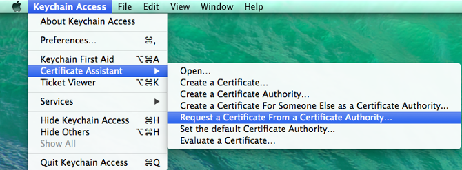
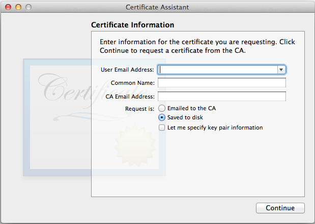
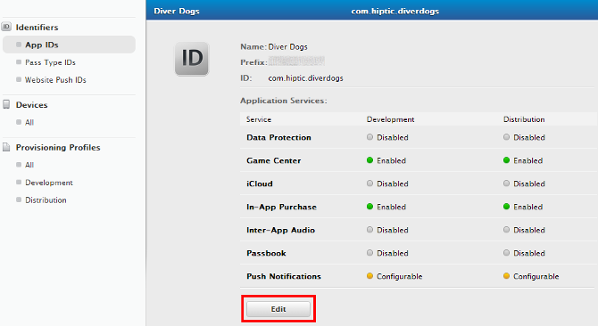
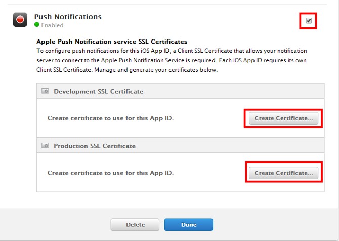
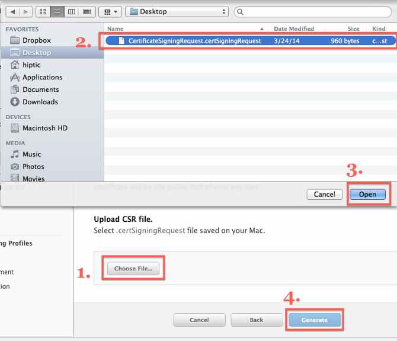
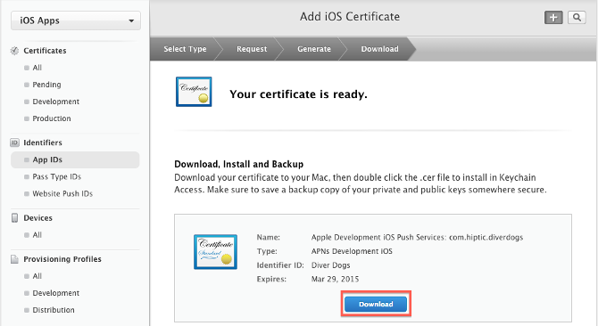

# Google and Apple certificates

Before you start sending notifications, you will need Google Cloud Messaging (GCM) and Apple Push Notification Service (APN) certificates.

Obtaining a GCM key can be done by following the documentation on 
[developers.google.com](https://developers.google.com/api-client-library/php/guide/aaa_apikeys#acquiring-an-api-key).   
Once acquired, store the key in Pushkin configuration: `config.ini`.   
You can find `config.ini` in Pushkin root dir, and the field you must find is named `gcm_access_key` under **Messenger** section.   
Under the same section there is `apns_certificate_path` field where you must provide the path to your APN certificate. If you already have an APN certificate, you can skip the next part.

**Obtaining APN certificate**

1. Open Keychain Access on your Mac OS X system. It may be located in ***Applications > Utilities > Keychain Access***.
<br/>
<br/>

* Select ***Keychain Access > Certificate Assistant > Request a Certificate From a Certificate Authority...***
	
<br/>
<br/>

* Select the ***Save to disk*** option and enter your information in the required fields. This creates a certification request file that will be used later.
	
<br/>
<br/>

* Select your app from the [Apple's Developer site](https://developer.apple.com/account/ios/identifier/bundle) and press ***Edit***
	
<br/>
<br/>

* Scroll down to the bottom and enable Push Notifications and press ***Create Certificate...*** in either Development or Production. Here's the difference between each kind of certificate:
	* Sandbox Push Certificate (Also known as Development) - For sending push notifications to a development version of your app that was built with an Apple Development provisioning profile.
	* Production Push Certificate - For production builds that are submitted to the app store built with an Apple "App Store" provisioning profile, or for testing push notifications in an Ad-Hoc build built with an Apple "Ad Hoc" provisioning profile.
	
	Basically, you will want to start with a Sandbox (Development) Push Certificate when developing or updating your app. Then before submitting your app built it with an "Ad Hoc" Provisioning Profile and Production Push Certificate and make sure it receives push notifications. Finally, when submitting your app continue using the production push certificate.
<br/>
<br/>
	
<br/>
<br/>

* Press ***Continue***
	
<br/>
<br/>

* Press ***Choose File...***, select the `.certSigningRequest` file you saved in *step 1*, press ***open***, and then press ***Generate***.
	
<br/>
<br/>

* Press ***Download*** to save your certificate
	
<br/>
<br/>

* Open the `.cer` file you downloaded in the last step by double clicking on it in ***Finder***.
	
<br/>
<br/>

* After a few seconds the **Keychain Access** program should pop up. ***Select Login > Keys*** then right click on your key in the list and select ***Export***.
	
<br/>
<br/>

* Give the file a unique name and press ***save***. You will have an option to protect the file with a password. 
<br/>
<br/>

* Now you need to convert .p12 key to .pem without password, afterwards it can be used in Pushkin. You have 4 commands that you must execute in terminal.

Commands:
```bash
openssl pkcs12 -clcerts -nokeys -in prod_push.p12 -out prod_push_cer.pem
openssl pkcs12 -nocerts -in prod_push.p12 -out prod_push_key.pem
openssl rsa -in prod_push_key.pem -out prod_push_key_nopass.pem
cat prod_push_cer.pem prod_push_key_nopass.pem > prod_push_nopass.pem
```

We also presume that you have implemented GCM client side. For instructions you can look on [developers.google.com](https://developers.google.com/cloud-messaging/android/client).

---
