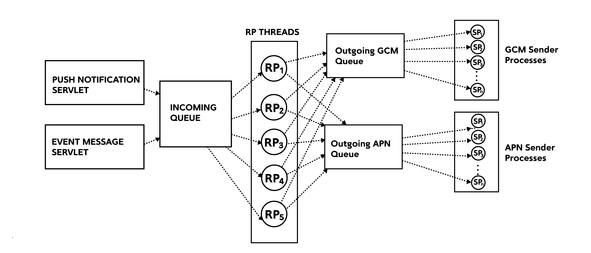

# Getting started

## Introduction

Pushkin is a **free open source tool** for sending push notifications. It was developed with a focus on speed and enabling fast experimentation.
Pushkin was mainly built for supporting online mobile games, but can easily be extended to any type of application. It supports both Android and iOS platforms.

Pushkin is designed to be a responsive tool. You can design your systems around Pushkin so it reacts to your game server, database server, client or really any service that can send a HTTP POST request. It is also easily scalable, because you can run as many Pushkin instances as you want. One instance is capable of pushing 500 messages per second.

Pushkin has MIT license.

---

## Use cases

To fit all use cases, Pushkin has 2 modes of operations:

1. **Push Notification mode** - You can issue a direct notification, meaning that you supply the user and the message. Pushkin will find the device id for the user and send the message. This is the most simple use case.

2. **Event mode** - You can send Pushkin an event, notifying it that something happened to a certain user. Pushkin will then decide whether it can send a notification based on that event or not. If yes, Pushkin will construct the message in the proper language for the user (localization is supported), find the device id of the user mobile device and notification will be sent.

These two use cases can be seen on the diagram below:


---

## Quick start

### Step 0 - Requirements

In order to run Pushkin you must have **Python2.7**, **pip2.7**, **PostgreSQL 9.2+** installed and setup. Also you will need *Postgres* **hstore** extension in *pushkin* database.

---

### Step 1 - Installation

There are 2 ways to install Pushkin:

**Using pip:**
Coming soon...

**From source:**

Clone Pushkin git repo:

```bash
git clone https://github.com/Nordeus/pushkin.git
cd pushkin
```
It will be cloned to a subdirectory called `pushkin`.

Make sure to place it in some permanent location, as for an editable installation, Python will import the module directly from this directory and not copy over the files.

To install Pushkin run:
```bash
python setup.py install
```

Pushkin is then ready to use.

---

### Step 2 - Setup database

Before starting Pushkin you should run the tests to make sure everything works
fine. Requirements before running tests is to make database `pushkin` which is
owned by user `pushkin` which has a password `pushkin` (defined in `tests/test_config.ini`) and to load *SQL* schema.
You will also need to install the `hstore` extension.

```bash
psql -U postgres -c "CREATE USER pushkin WITH PASSWORD 'pushkin'"
psql -U postgres -c "CREATE DATABASE pushkin WITH OWNER pushkin"
psql -U postgres -d pushkin -c "CREATE EXTENSION HSTORE"
```

You can initiate the testing by executing: 

```bash
python setup.py test
```

If tests pass, Pushkin is installed correctly.

### Step 3 - Setup certificates

Before you start sending notifications, you will need Google Cloud Messaging (GCM) and Apple Push Notification Service (APN) certificates.

You can see how to obtain these certificates on [Setup Certificates page](certificates.md).

---

### Step 4 - Starting Pushkin

If you are starting Pushkin for the first time you should initialize the database which you created in *Step 2* with the following command:
```bash
pushkin --configuration config.ini --init-db
```

Now you can start Pushkin:
```bash
pushkin --configuration config.ini
```

Pushkin log is located by default in `/var/log/pushkin/pushkin.log`. Default log level is INFO, you can change it in `config.ini` file.   
Sent notifications are logged in file `/var/log/pushkin/notification/notification.csv` by default.

---

## Design and Features

Pushkin was designed with scalability and modularity in mind. We chose to build Pushkin in Python because it is a very popular language, easy to use, easy to learn and has good performance.

Internally, you can divide Pushkin into multiple modules.

1. **Input Servlets**   
	Input servlets take care of all incoming requests. There are 2 types of servlets in Pushkin, event message and push notification servlets.

* **Incoming queue**   
	When servlets process incoming requests, they are dispatched into a queue where they will be picked up by request processing threads.

* **Request processor**   
	Request processor manages all incoming requests. It processes them and depending on request type, it constructs the message, localizes it, finds the user device or stores it and in the end it can dispatch an outgoing message to GCM or APN queues.

* **Outgoing queues**   
	There are two outgoing queues in Pushkin. GCM and APN queues schedule Android and iOS push notifications, respectively.

* **Sender processes**   
	Sender processes are in charge of dispatching messages that are coming in from the outgoing queues





Pushkin has some cool features that you can take advantage of, if you choose to use Pushkin in event mode. In that mode, for every new message you create, you must specify an event that will trigger that message. Features you can use then are cooldown, localization and deep linking.

*Cooldown* - To prevent accidentally spamming your users, for every message you can specify a cooldown interval. This will prevent Pushkin from sending the same message to the same user twice in that interval, even if it receives appropriate events. For example, if you receive a notification which has a cooldown interval of 2 hours at 6pm, you cannot receive the same notification again until at least 8pm. 

*Deep linking* - If you have [deep linking](https://en.wikipedia.org/wiki/Mobile_deep_linking) implemented on your client application, Pushkin enables you to define a deep link for every message.

*Localization* - Once you create a new message, you can add multiple versions of that message in different languages. In special login events, which are sent upon every user login to your application, Pushkin will receive the language a user uses. Upon receiving an event that will generate a message, Pushkin will pick the one that is written in the same language the user uses.

---

# API

## Database API

Pushkin stores data about users, devices and messages in PostgreSQL database. There is a database module with functions which should cover most use cases like adding messages or updating device data. For advanced usage of database ORM model for [SQLAlchemy](http://www.sqlalchemy.org/) is available.

*Prerequisites for using Database API*
```python
# you should first install and setup Pushkin
from pushkin.database import database
from pushkin import context
# update path to config.ini if you installed Pushkin in different directory
context.setup_configuration('/opt/pushkin/config.ini')
database.init_db()
```
---

### Messages and localizations

Pushkin has two entities for working with notifications - **message** and **localization**. Message contains common data for a message and localization takes care of translation of a message into various languages.

**Message** is identified by its `name`, which is unique for every message. Besides name message has following data available through ORM model:

* `trigger_event_id` - event which triggers a message (`int`)

* `cooldown_ts` - minimum interval in milliseconds for sending the same notification twice, to avoid spam (`int`, optional)

* `screen` - landing screen after opening notification (`str`, optional)

* `localizations` - list of localizations of a message


**MessageLocalization** has translations for messages. Following data is available through ORM model:

* `language_id` - language of a message, identified the same as in your application (`int`)

* `message_title` - message title in specific language

* `message_text` - message text in specific language

* `message` - message entity

*Example of adding a message into database*
```python
database.add_message('test_message', 1, 'English title', 'English message', trigger_event_id=1)
database.add_message('test_message', 2, 'Deutsch Titel', 'Deutsch Nachricht', trigger_event_id=1)
```

---

### Logins and devices

Pushkin has two entities for working with user data - **login** and **device**. Login contains common data for a user and device has data of all devices.

**Login** is identified by `id` of user, as in your application. Login id must be of type integer. Besides id login has following data about user available through ORM model:

* `language_id` - language in which user uses your application, which is identified the same as in your application (`int`)

* `devices` - list of devices which user uses for your application


**Device** entity represents devices which a user uses for your application. Following data is available through ORM model:

* `platform_id` - platform of a device, currently available platforms are
	* Android Phone = 1
	* iPhone = 2
	* iPad = 5
	* Android Tablet = 6   
	(`int`)

* `device_id` - unique identifier of a device on his platform (`str`)

* `device_token` - identifier of a device at push notification service (GCM or APN)

* `device_token_new` - in case device_token changes for a device (which happens on Android platform) new one is stored here

* `application_version` - version of your application installed on a device

* `unregistered_ts` - for future use

* `login` - login entity

*Example of adding login and device data into database*
```python
database.process_user_login(login_id=12345, language_id=1, platform_id=1, device_id='qwe', device_token='123', application_version=1)
```

---

### Database module

* Get SQLAlchemy session.
```python
pushkin.database.get_session()
```

* Close SQLAlchemy session
```python
pushkin.database.close_session()
```

* Get device tokens for a given login
```python
pushkin.database.get_device_tokens(login_id)
```

* Add or update device and login data
```python
process_user_login(login_id, language_id, platform_id, device_id, device_token, application_version)
```

* Add or update a login entity.
```python
upsert_login(login_id, language_id)
```

* Add or update a device entity.
```python
upsert_device(login_id, platform_id, device_id, device_token, application_version, unregistered_ts=None)
```

* Get list of all logins
```python
get_all_logins()
```

* Get a specific login by id.
```python
get_login(login_id)
```

* Delete a specific login together with all devices of that user.
```python
delete_login(login)
```

* Delete a specific device.
```python
delete_device(device)
```

* Get message localization for language of a specific user.
```python
get_localized_message(login_id, message_id)
```

If translation for language of a user doesn't exist English translation is given.

* Add or update a message.
```python
upsert_message(message_name, cooldown_ts, trigger_event_id, screen)
```

* Add or update a message localization.
```python
upsert_message_localization(message_name, language_id, message_title, message_text)
```

* Add or update a message with localization for one language.
```python
add_message(message_name, language_id, message_title, message_text, trigger_event_id=None, cooldown_ts=None, screen='')
```

* Get list of all messages from database.
```python
get_all_messages()
```

* Get a specific message.
```python
get_message(message_name)
```

* Delete a specific message with all localizations.
```python
delete_message(message)
```

* Delete a specific message localization.
```python
delete_message_localization(message_localization)
```

* Return a mapping of event ids to messages ids in format `{event_id: [message_ids]}`.
```python
get_event_to_message_mapping()
```

* Update last time a message id was send for a user.
```python
get_and_update_messages_to_send(user_message_set)
```

Expects a set of (`login_id`, `message_id`) tuples.

---

## Input API

### Introduction

Pushkin supports two ways for sending push notifications - through notification and event api. Notification API is simpler to use and useful if you just want a quick and dirty way to send some push notifications quickly. Event API is where the full power of Pushkin is utilized - it allows you to decouple triggers for notifications from concrete notifications you want to send so you can configure your messages without having to change your main application. It also provides a monitoring set of methods which are useful in production environments when you want to monitor how your instances are doing under heavier loads.

---

### Format

Pushkin uses HTTP POST requests for notification and event APIs and HTTP GET for monitoring API. Currently Protocol Buffers and JSON are supported, but it is easy to extend to any other format in the future.

---

### Notification API

**Method:** POST

**JSON endpoint:** `http://localhost:8887/post_notification_json`

**Format:**
```json
{
  "notifications": [
    {
      "login_id" : <unique-user-id>,
      "title" : "<notification-title>",
      "content" : "<notification-content>",
      "screen" : "<screen>"
    }
  ]
}
```
<br/>

**Protobuf endpoint:** `http://localhost:8887/post_notification_proto`

**Format:**
```
message PushNotification {
  optional int64 login_id = 1;
  optional string title = 2;
  optional string content = 3;
  optional string screen = 4;
}

message BatchNotificationRequest {
  repeated PushNotification notifications = 1;
}
```
<br/>

**Field description:**

* `notifications` - a list of notifications to send. If you want to send multiple messages at once, it is more efficient to batch them in a single request.

* `login_id` - Unique user identifier. A message sent to an user will be sent to all his devices. Required.

* `title` - Title of push notification. Required.

* `content` - Content of push notification. Required.

* `screen` - A code string sent to devices. Can be used to map push notification to a click action on client side. Optional.


**Notes:**   
Be careful about correct [JSON](http://www.json.org/) syntax! For example, it is import to quote string fields and to leave numeric fields unquoted. Refer to example for a quick check.
It is required to register devices to recipient user first. This can be done either through database API or by sending login events through event API.   
Notification API does not take user language into consideration as you specify concrete message content to be sent.

**Example:**   
Send two notifications in a single batch

JSON string
```json
{
  "notifications": [
    {
      "login_id" : 1337,
      "title" : "Hi User1",
      "content" : "Sent from Pushkin",
      "screen" : "welcome_screen"
    },
    {
      "login_id" : 1338,
      "title" : "Hi User2",
      "content" : "Also sent from Pushkin"
    }
  ]
}
```


Protobuf request from Python2.7
```
from pushkin.protobuf import PushNotificationMessage_pb2

notification_request_proto = PushNotificationMessage_pb2.BatchNotificationRequest()
notification1 = notification_request_proto.notifications.add()
notification1.login_id = 1337
notification1.title = "Hi User1"
notification1.content = "Sent from Pushkin"
notification1.screen = "welcome_screen"

notification2 = notification_request_proto.notifications.add()
notification2.login_id = 1338
notification2.title = "Hi User2"
notification2.content = "Also sent from Pushkin"

request = notification_request_proto.SerializeToString()
```

---

### Event API

**Method:** POST

**JSON endpoint:** `http://localhost:8887/post_events_json`

**Format:**
```json
{
  "events": [
    {
      "user_id" : <unique-user-id>,
      "event_id" : <event-id>,
      "timestamp" : <unix-timestamp-milliseconds>,
      "pairs": {
        "<key1-name>" : "<value1-name>",
        "<key2-name>" : "<value2-name>",
      }
    }
  ]
}
```
<br/>

**Protobuf endpoint:** `http://localhost:8887/post_events_proto`

**Format:**
```
message Event {
  optional int64 user_id = 1;
  optional int32 event_id = 2;
  optional int32 event_type = 3;
  optional int64 timestamp = 4;
  message Pair {
    required string key = 1;
    required string value = 2;
  }
  repeated Pair pairs = 5;
}

message BatchEventRequest {
  repeated Event events = 1;
}
```
<br/>

**Field description:**

* `events` - a list of events to send. If you want to send multiple events at once, it is more efficient to batch them in a single request.

* `user_id` - Unique user identifier of the event. Required.

* `event_id` - Unique integer identifier of the event. Required.

* `event_type` - Not used currently. Optional.

* `timestamp` - Unix timestamp in milliseconds when the event happened. Required.

* `pairs` - Key/value pairs used to parametrize the event.

**Predefined events**

Pushkin defines prebuilt events which you can use immediately. Those are events in range `4000-4999` and you should not define custom events in this range. List of prebuilt events:

**Login event**

Used to register a device to a specific user. It also keeps track of user details. It is recommended to send this when the user logs in your application if you support such functionality.

* Event ID: 4001

* Key/Value pairs definition:

	* `languageId` - A number representing a language. It is up to you to keep track of those language ids and map them however you want. When a message is triggered by an event, a notification with corresponding language id will be sent to the user. Updated to the value of last login event. Required.

	* `platformId` - An identifier indicating the platform of the device. Currently supported platforms are:
		* Android Phone = 1,
		* iPhone = 2,
		* iPad = 5,
		* Android Tablet = 6.   
		Required.

	* `deviceId` - Unique identifier for this device. You can find the instructions online how to retrieve this for both Android and iOS devices. Required.

	* `deviceToken` - Token string for sending push notifications to this device. Can be found in the documentation of Android (GCM) / iOS (APN) push notification service provider. Required.

	* `applicationVersion` - Integer value of the current version of the application. For future use. Optional.

**Notes:**   
Be careful about correct [JSON](http://www.json.org/) syntax! For example, it is import to quote string fields and to leave numeric fields unquoted. Refer to example for a quick check.
It is required to register devices to recipient user first. This can be done either through database API or by sending login events through event API.
Event API takes user current language id into consideration and will messages with the same localization id.


**Example:**   
Send two events in a single batch

JSON String
```json
{
  "events": [
    {
      "user_id" : 1337,
      "event_id" : 1,
      "timestamp" : 1458823445000
    },
    {
      "user_id" : 1338,
      "event_id" : 1,
      "timestamp" : 1458823448000,
      "pairs": {
        "platformId" : "1",
        "deviceId" : "S342DFS",
        "deviceToken" : "VD3#fd4",
        "applicationVersion" : "1"
      }
    }
  ]
}
```

Protobuf request from Python2.7
```
from pushkin.protobuf import EventMessage_pb2

event_request_proto = EventMessage_pb2.BatchEventRequest()
event1 = event_request_proto.events.add()
event1.user_id = 1337
event1.event_id = 1
event1.timestamp = 1458823445000

login_event = event_request_proto.events.add()
login_event.user_id = 1337
login_event.event_id = 4001
login_event.timestamp = 1458823448000
# add some parameters
pair = event_proto.pairs.add()
pair.key = 'platformId'
pair.value = '1'
pair = event_proto.pairs.add()
pair.key = 'deviceId'
pair.value = 'S342DFS'
pair = event_proto.pairs.add()
pair.key = 'deviceToken'
pair.value = 'VD3#fd4'
pair = event_proto.pairs.add()
pair.key = 'applicationVersion'
pair.value = '1'

request = event_request_proto.SerializeToString()
```

---

### Monitoring API

**Method:** GET

**Endpoint:** `http://localhost:8887/get_request_queue`   
**Notes:**
Returns the number of items in request queue. Requests are events and push notifications requests that are waiting to be transformed to concrete push notifications. Default maximum is 50000, anything above will be discarded.


**Endpoint:** `http://localhost:8887/get_apn_sender_queue`   
**Notes:**
Returns the number of items in APN (iOS) queue. Those are APN push notifications waiting to be sent.  Default maximum is 50000, anything above will be discarded.


**Endpoint:** `http://localhost:8887/get_gcm_sender_queue`   
**Notes:**
Returns the number of items in GCM (Android) queue. Those are APN push notifications waiting to be sent.  Default maximum is 50000, anything above will be discarded.

---

# Configuration

Pushkin is configured through `.ini` file in root folder.

Here is a list of configurations along with comments and default values:

```
[ServerSpecific]
# Name of your application
game = GameName

# Id of pushkin instance
world_id = 1

# Default API port
port = 8887

[Messenger]
# if true, gcm clients will not receive notifications
dry_run = false

# max batch size for apn notifications
apns_batch_size = 500

apns_certificate_path = <ABSOLUTE-PATH-TO-APN-CERTIFICATE-HERE>
gcm_access_key = <YOUR-GCM-KEY-HERE>

# for future use
apns_sandbox = false
connection_error_retries = 3

# Baselink for your application sent with push notifications
base_deeplink_url = application_name.com

[RequestProcessor]
# queue limit for requests processor. See Monitoring API for reference
queue_limit = 50000

# Number of threads for request processor
request_processor_num_threads = 10

[Sender]
# queue limit for sender processor. See Monitoring API for reference
sender_queue_limit = 50000

# interval for batching apn messages
apn_sender_interval_sec = 3
apn_num_processes = 10
gcm_num_processes = 30

[Log]
# log configuration
main_logger_name = pushkin
notifications_logger_name = notifications
main_log_path = /var/log/pushkin/
notification_log_path = /var/log/pushkin/notification/
# notset, debug, info, warning, error, critical
main_log_level = INFO
keep_log_days = 7

[Database]
# database credentials
db_user = pushkin
db_name = pushkin
db_pass = pushkin

[Event]
# event id of prebuilt login event
login_event_id = 4001
```

---

# Support

You can ask questions and join the development discussion on the [Pushkin-Dev Google group](https://groups.google.com/forum/#!forum/pushkin-dev).


---
